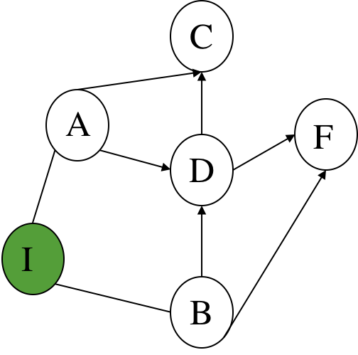
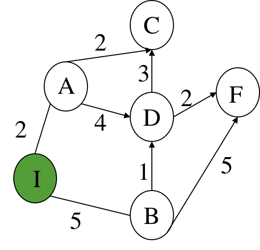
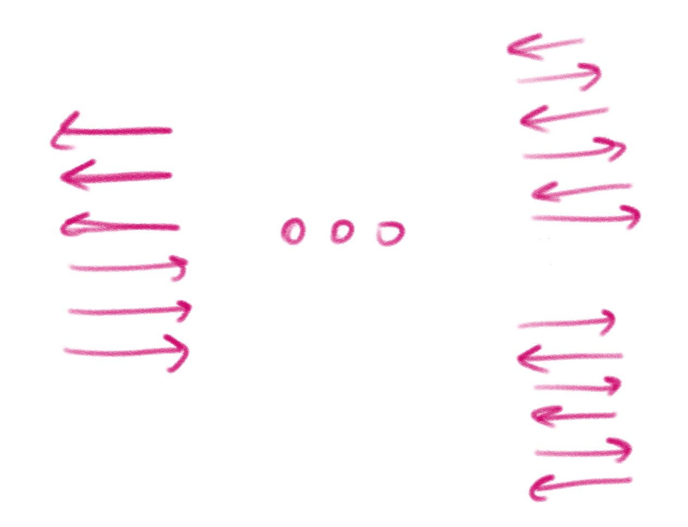

# Introdução à Inteligência Artificial - PEE / 1 - Formulação[¶](#Introdução-à-Inteligência-Artificial---PEE-/-1---Formulação)

# Guião Laboratorial[¶](#Guião-Laboratorial)

(30/Set:04/Out-2019)

## Introdução[¶](#Introdução)

Vamos ver como poderemos, usando a linguagem Python, resolver problemas formulados de acordo com o paradigma do espaço de estados (PEE). Para isso, há que completar dois passos:

1.  Definir o problema;
2.  Utilizar um algoritmo de procura para o resolver.

Nesta aula vamos tratar apenas da formulação, i.e., da definição do problema.

Recordando, para formularmos um problema de acordo com esta metododologia, precisamos de:

*   **Estados**: Idealizar uma representação para o que vamos considerar um estado. Notem que o estado deve ser mínimo, apenas deve conter a informação que muda com as acções;
*   **Estado Inicial**: Identificar o estado inicial;
*   **Objectivo**: Verificar se um estado satisfaz o objectivo, sendo assim, um dos estados finais;
*   **Acções**: Para cada estado, caracterizar rigorosamente as acções de mudança de estado, de que modo incrementam os custos dos caminhos, e quais os estados resultantes.

## Recursos necessários[¶](#Recursos-necessários)

*   Para executar as experiências que se seguem, copie o módulo [searchPlus.py](searchPlus.py) para a directoria de trabalho.
*   Copie para o mesmo local os outros módulos auxiliares necessários: [utils.py](utils.py)
*   Crie um novo modulo **pee1.py** para ir realizando as experiências sugeridas.

## Módulo _searchPlus.py_ - breve explicação[¶](#Módulo-searchPlus.py---breve-explicação)

Este módulo é uma variante muito ligeira do search.py que está disponível no repositório [aima-python](https://github.com/aimacode/aima-python), que contém a implementação (em Python) da generalidade dos algoritmos descritos no livro da disciplina (Russell & Norvig). Muitas das definições deste módulo não serão utilizadas. Vamos apenas concentrar-nos em algumas das suas classes e funções. No essencial, é disponiblizado o seguinte:

*   A classe **Problem**, que vamos utilizar para definir os problemas;
*   A classe **Node**, que representa um **_nó de procura_**, utilizada pelos algoritmos de procura implementados;
*   A implementação de vários algoritmos de procura.

Para esta aula dedicada à formulação, apenas precisamos de usar a classe **Problem** do módulo, que tem de ser importado, mas não deverá alterá-lo.

In [ ]:

<pre>from searchPlus import *
</pre>

## Exemplo base[¶](#Exemplo-base)

Para já, vamos ilustrar com um exemplo de problema que consiste num grafo de estados, com um estado inicial I e final F. Queremos encontrar uma sequência de acções que nos leve de I a F.

### Representação de um estado[¶](#Representação-de-um-estado)

Não há qualquer restrição quanto ao tipo que o estado pode assumir (pode ser um inteiro, uma string, uma lista, um tuplo, etc, ou um tipo definido recorrendo a uma nova classe).

Neste exemplo do grafo abstracto, o estado é apenas uma etiqueta sem estrutura, Em python, vamos considerar que um estado é uma string de um caracter que corresponde aos nós do grafo. Vamos ter o seguinte conjunto de estados: {'I', 'A','B', 'C', 'D', 'F'}.

### A classe **Problem**[¶](#A-classe-Problem)

Esta classe funciona como uma classe _abstracta_. Para definir um problema concreto é necessário criar uma sua sub-classe. A classe **Problem** tem um construtor em que se passa o estado inicial e o estado final ou conjunto de estados finais e a função de teste do objectivo apenas verifica se um estado é igual ao estado final ou se pertence ao conjunto dos estados finais, respectivamente; tem também um método **_path_cost()_**, por defeito, que considera que todas as acções possuem custo 1, o que é o caso do nosso grafo em cima.

In [ ]:

<pre>## Apenas a definição da classe, ainda sem qualquer conteúdo
class ProblemaGrafo(Problem) :
    pass
</pre>

Um problema é criado fornecendo a identificação do estado inicial e, opcionalmente, o objectivo. Veja-se a assinatura do construtor:

<pre>def __init__(self, initial, goal=None):
    """The constructor specifies the initial state, and possibly a goal
 state, if there is a unique goal. Your subclass's constructor can add
 other arguments."""
        self.initial = initial
        self.goal = goal
</pre>

Por exemplo, para criarmos o problema de encontrar um caminho entre **'I'** e **'F'** no espaço acima, poderíamos fazer:

In [ ]:

<pre>problema_1 = ProblemaGrafo('I','F')
</pre>

Os atributos **initial** e **goal** guardam esta informação:

In [ ]:

<pre>print(problema_1.initial)
print(problema_1.goal)
</pre>

#### Definição do objectivo[¶](#Definição-do-objectivo)

Há duas formas de definir o teste de satisfação do objectivo:

1.  Indicando explicitamente o seu valor, utilizando o parâmetro **_goal_** do construtor; o parâmetro **_goal_** pode ser também uma lista de estados, nos casos em que existam vários estados finais.
2.  Redefinindo o método **goal_test()** na classe que define o nosso problema:

<pre>def goal_test(self, state):
        """Return True if the state is a goal. The default method compares the
 state to self.goal or checks for state in self.goal if it is a
 list, as specified in the constructor. Override this method if
 checking against a single self.goal is not enough."""
        if isinstance(self.goal, list):
            return state in self.goal
        else:
            return state == self.goal
</pre>

Este método retornará `True` nos casos em que o estado fornecido (**state**) seja o estado final ou membro dos estados finais.

No exemplo acima, utilizámos a primeira opção, definindo como objectivo o estado **F**.

#### Operadores[¶](#Operadores)

A implementação dos operadores de mudança de estado é feita com base na definição de dois métodos:

*   `actions(self, state)` - Este método, dado um estado, devolve a lista de todas as acções possíveis nesse estado; a representação concreta do que é uma acção fica em aberto.
*   `result(self, state, action)` - Dados um estado e uma acção, este método devolve o estado resulante da execução da acção **_action_**, no estado **_state_**.

A definição destes dois métodos na classe que define o problema é **_obrigatória_**. Notem que a classe Problem tem os métodos **_actions()_** e **_result()_** por implementar.

In [ ]:

<pre>problema_1.actions(problema_1.initial)
</pre>

Continuando o mesmo exemplo, antes de definir estas funções, temos que representar o grafo que define o espaço de estados ilustrado acima.

Uma possiblidade é utilizar um dicionário:

<pre>grafo = {'I':['A','B'],
         'A':['C','D','I'],
         'B':['D','F','I'],
         'C':[],
         'D':['C','F'],
         'F':[]}
</pre>

Nesta representação de um grafo, a chave é um estado, sendo o valor correspondente a lista dos possíveis sucessores.

Como os custos dos arcos são homogéneos, não é necessário representá-los. A classe **Problem** atribui o custo 1 a cada acção por defeito, através do método **_path_cost()_**. Mas o método recebe como parâmetro o custo que vai do estado inicial até state1 e adiciona-lhe 1, que é o custo de ir de state1 para state2.

<pre>def path_cost(self, c, state1, action, state2):
        """Return the cost of a solution path that arrives at state2 from
 state1 via action, assuming cost c to get up to state1\. If the problem
 is such that the path doesn't matter, this function will only look at
 state2\.  If the path does matter, it will consider c and maybe state1
 and action. The default method costs 1 for every step in the path."""
        return c + 1
</pre>

Não precisaremos de redefinir este método mas apenas o método **_actions()_** e o método **_result()_**. Vamos a isso.

##### Definindo o método **_actions()_**[¶](#Definindo-o-método-actions())

Neste exemplo abstracto, uma acção é simplesmente uma transição entre dois estados, X e Y, que poderemos representar pela string **"Ir de X para Y"**.

Assim, podemos ter a seguinte definição do método **_actions()_**:

<pre>def actions(self,estado) :
    sucessores = self.grafo[estado]  # obter lista dos sucessores
    accoes = map(lambda x : "ir de {} para {}".format(estado,x),sucessores) # compor as strings que representam cada uma das possíveis acções
    return list(accoes)
</pre>

Notem que a função **_map()_** aplica uma função a todos os elementos de uma lista. Neste caso, a função é uma função lambda ou anónima, criada e usada na hora.

##### Definindo o método **_result()_**[¶](#Definindo-o-método-result())

O método **_result()_** recebe como um dos parâmetros uma acção, que terá que ter o formato determinado pelo método **_actions()_**. Não tem de se preocupar com as pré-condições das acções porque é o método **_actions()_** que trata disso.

Como cada acção é uma cadeia de caracteres em que o último é o estado seguinte ou sucessor, destino da acção, o que queremos é obter a última palavra de uma _acção_. Vamos usar o método **_split()_** das strings para partir a frase numa lista de palavras e depois vamos buscar a última, usando o índice -1 de uma lista.

<pre>def result(self, estado, accao) :
        """Assume-se que uma acção é da forma 'ir de X para Y'
 """
        return accao.split()[-1]
</pre>

Vejamos então como fica a definição completa da classe:

In [ ]:

<pre>class ProblemaGrafo(Problem) :
    grafo = {'I':['A','B'],
             'A':['C','D','I'],
             'B':['D','F','I'],
             'C':[],
             'D':['C','F'],
             'F':[]}

    def actions(self,estado) :
        sucessores = self.grafo[estado]
        accoes = map(lambda x : "ir de {} para {}".format(estado,x),sucessores)
        return list(accoes)
        #
        # alternativamente:
        # accoes = ["ir de {} para {}".format(estado,x) for x in sucessores]
        # return accoes
        #
        # alternaivamente:
        # accoes = list()
        # for x in sucessores :
        #     accoes.append("ir de {} para {}".format(estado,x))
        # return accoes

    def result(self, estado, accao) :
        """Assume-se que uma acção é da forma 'ir de X para Y'
 """
        return accao.split()[-1]
</pre>

Podemos então redefinir o nosso problema e verificar se os métodos dão o resultado esperado:

In [ ]:

<pre>p1 = ProblemaGrafo('I','F')
</pre>

Vamos listar todos os estados

In [ ]:

<pre>print("Estados:")
for estado in p1.grafo.keys():
    print(estado)
</pre>

Listemos todas as acções possíveis a partir do estado inicial do problema

In [ ]:

<pre>p1.actions(p1.initial)
</pre>

Vejemos qual o resultado de executar a acção 'ir de I para B' a partir de I

In [ ]:

<pre>p1.result('I','ir de I para B')
</pre>

Testemos se 'B' é o estado final

In [ ]:

<pre>p1.goal_test('B')
</pre>

Vamos aplicar a primeira accão ao estado inicial e verifiquemos onde estamos

In [ ]:

<pre>p1.result(p1.initial,p1.actions(p1.initial)[0])
</pre>

Vamos testar a satisfação do objectivo e calcular os custo progressivamente à medida que vamos executando a primeira acção dado o estado inicial e a segunda dado o estado resultate.

In [ ]:

<pre>custo=0
e0 = p1.initial
print('Em',e0,'com custo',custo)
print('Cheguei ao objectivo?',p1.goal_test(e0))
a1 = p1.actions(e0)[0]
e1 = p1.result(e0,a1)
custo = p1.path_cost(custo,e0,a1,e1)
print('Após executar a 1ª acção:', a1, 'passei para ',e1, ', com custo',custo)
print('Cheguei ao objectivo?',p1.goal_test(e1))
a2 = p1.actions(e1)[0]
e2 = p1.result(e1,a2)
custo = p1.path_cost(custo,e1,a2,e2)
print('Após executar a 2ª acção:', a2, 'passei para ',e2, ', com custo',custo)
print('Cheguei ao objectivo?',p1.goal_test(e1))
</pre>

#### A função **_**eq()**_**[¶](#A-função-eq())

Quando existem vários estados finais que podemos enumerar, o método **_goal_test()_** verifica se um estado é membro de uma lista de estados usando "in". Neste caso, como os estados são strings o "in" funciona bem e não é preciso redefinir o teste de igualdade. De notar que se os estados fossem instâncias de uma classe e não strings, e como dois objectos diferentes mas com o mesmo conteúdo não são naturalmente iguais mas deveriam ser iguais, teríamos de redefinir o **_**eq()**_**.

#### Exercício 1[¶](#Exercício-1)

Crie um problema da classe **ProblemaGrafo** com o estado inicial 'A' e estados finais 'F' e 'E'

#### Exercício 2[¶](#Exercício-2)

Como poderá mudar o grafo da classe **ProblemaGrafo** de modo a poderem utilizar diferentes grafos e não apenas este? Ficam aqui duas sugestões e podem implementar as duas: (1) mudem o valor do atributo estático antes ou depois de criarem uma instância da classe; (2) Refaçam a classe de modo a que o grafo seja passado como parâmetro no construtor, sendo um atributo dinâmico e privado de cada objecto do tipo **ProblemaGrafo**.

## Grafo abstracto com custos[¶](#Grafo-abstracto-com-custos)

Vamos primeiro representar este grafo com custos num dicionário em que cada chave é um estado e em que o valor é um novo dicionário, sendo a chave o estado sucessor e o valor o custo do arco. O grafo será guardado no atributo grafo da nova classe

<pre>grafo = {'I':{'A':2,'B':5},
             'A':{'C':2,'D':4,'I':2},
             'B':{'D':1,'F':5,'I':5},
             'C':{},
             'D':{'C':3,'F':2},
             'F':{}}
</pre>

Olhemos agora para um grafo em que os custos não são homogéneos. Por exemplo este:

Para além disso, precisamos de criar um método **_path_cost()_** que se vai sobrepor ao método da super-classe **Problem**. Lembram-se que este último devolve sempre 1 como custo. Este método recebe o custo actual do caminho (c) desde o estado inicial até ao estado **_state1_**, calculado pelo algoritmo de procura. A acção (**_action_**) provoca uma transição entre **_state1_** e **_state2_** e o custo da acção é adicionado a **_c_**. Para sabermos qual o custo da acção que leva do **_state1_** ao **_state2_** teremos de ir ler no grafo.

<pre>def path_cost(self, c, state1, action, state2):
        return c + self.grafo[state1][state2]
</pre>

Vejamos então a definição completa da nova classe:

In [ ]:

<pre>class ProblemaGrafoCustos(Problem) :
    grafo = {'I':{'A':2,'B':5},
             'A':{'C':2,'D':4,'I':2},
             'B':{'D':1,'F':5,'I':5},
             'C':{},
             'D':{'C':3,'F':2},
             'F':{}}

    def __init__(self,initial = 'I', final = 'F') :
        super().__init__(initial,final)

    def actions(self,estado) :
        sucessores = self.grafo[estado].keys()  # métodos keys() devolve a lista das chaves do dicionário
        accoes = list(map(lambda x : "ir de {} para {}".format(estado,x),sucessores))
        return accoes

    def result(self, estado, accao) :
        """Assume-se que uma acção é da forma 'ir de X para Y'
 """
        return accao.split()[-1]

    def path_cost(self, c, state1, action, state2):
        """Assume-se que action é da forma 'ir de <state1> para <state2>'
 """
        return c + self.grafo[state1][state2]
</pre>

Vamos criar um problema e executar algumas operações.

In [ ]:

<pre>p = ProblemaGrafoCustos()
custo = 0
print("Estado inicial:",p.initial, 'com custo',custo)
print("Estado final:",p.goal)
actions = p.actions(p.initial)
print('Cheguei ao objectivo?',p1.goal_test(e0))
print("As acções do estado inicial:",str(actions))
e1 = p.result(p.initial,actions[1])
print("Partindo de", p.initial,"executo a acção de " + actions[1]+" e vou parar em :",e1)
custo = p.path_cost(0,p.initial,actions[1],e1)
print("O custo desde o início é:",custo)
print('Cheguei ao objectivo?',p1.goal_test(e1))
e2 = p.result(e1,p1.actions(e1)[1])
print("Partindo de", e1,"executo a acção de " + p1.actions(e1)[1]+" e vou parar em :",e2)
custo = p.path_cost(custo,e1,actions[1],e2)
print("O custo desde o início é:",custo)
print('Cheguei ao objectivo?',p1.goal_test(e2))
</pre>

## O Problema da inversão das setas[¶](#O-Problema-da-inversão-das-setas)

 Nesta aula vamos ver como poderemos, usando a linguagem Python, formular o problema da inversão das setas

Recordando o enunciado: Imagine que temos seis setas dispostas de cima para baixo, em que as primeiras 3 estão orientadas para a esquerda e as 3 últimas para a direita e que queremos obter seis setas com orientação alternadas, quando o único movimento possível é inverter a orientação de duas setas adjacentes.

Se partirmos da situação inicial e aplicarmos a inversão das duas primeiras setas, obteremos todas orientadas para a direita, excepto a terceira.

### Representação dos estados[¶](#Representação-dos-estados)

Podemos representar os estados deste problema como sendo objectos com um atributo que é uma lista de comprimento 6 em que da esquerda para a direita representamos a orientação das setas de cima para baixo, em que "d" indica que uma seta aponta para a direita e "e" representa o sentido da seta para a esquerda. A situação inicial é dada pela lista: [e,e,e,d,d,d]

Vamos ter um atributo **_setas_** onde guardamos a lista.

Precisamos de um método que inverta uma seta: de "e" para "d" e viceversa.

E precisamos de um método que permita inverter um par de setas adjacentes indicando o primeiro índice: 1 para inverter a primeira e a segunda, ..., 5 para inverter a quinta e sexta setas.

Finalmente, precisamos de imprimir as setas de um modo mais ou menos "pretty".

In [ ]:

<pre>class EstadoSetas :

    """Um estado do problema da inversao das setas
 Uma lista de 6 setas (e's ou d's), indicando para cada seta se está orientada
 para a esquerda para para a direita
 A ordem da esquerda para a direita corresponde às setas de cima para baixo
 """
    def __init__(self,setas = ["e","e","e","d","d","d"]) :
        self.setas = setas

    def flip(self,seta) :
        """ Inversão do sentido de uma seta: de e para d e de d para e"""
        if seta=="e":
            return "d"
        else:
            return "e"

    def inverte(self,n) :
        """ Inverte duas setas, na posição n e n+1\. A primeira seta está na posição 0
 e para inverter a primeira e a segunda, de cima para baixo, implica n = 0.
 Gera uma nova lista.
 """
        copye = []
        for i in range(len(self.setas)) :
            if i == n-1 or i == n :
                copye.append(self.flip(self.setas[i]))
            else:
                copye.append(self.setas[i])
        return EstadoSetas(copye)

    def __str__(self) :
        return str("-".join(self.setas))
</pre>

Podemos criar uma instância de um estado, por exemplo, o caso inicial do problema, desta maneira, sem passar quaisquer argumentos:

In [ ]:

<pre>x = EstadoSetas()
print(x)
</pre>

Se quisermos criar uma nova instância, com outra combinação de orientações teremos de "pisar" o valor por omissão.

In [ ]:

<pre>x = EstadoSetas(["d","e","d","d","d","e"])
print(x)
</pre>

Se quisermos inverter a segunda e terceira seta de x, faremos:

In [ ]:

<pre>print("Começamos com:",x)
y = x.inverte(1)
print('Dado',x,"inverte a primeira e a segunda:",y)
z = y.inverte(2)
print('Dado',y,"inverte a segunda e terceira setas:",z)
</pre>

Podemos agora inverter de novo a 1ª e 2ª setas , depois de inverter a 2ª e 3ª, regressando à configuração inicial.

In [ ]:

<pre>f = z.inverte(2).inverte(1)
print("Iguais?",f == x)
print("f =",f)
print("x =",x)
</pre>

Como pudemos ver, os dois estados não são considerados iguais embora os seus atributos _setas_ sejam iguais. São duas instâncias diferentes. Assim, a função de teste **_goal_test()_** herdada de Problem não irá funcionar porque para verificar se um objecto é membro de uma lista é preciso que esse objecto seja membro da lista, i.e., igual a algum elemento da lista.

In [ ]:

<pre>EstadoSetas(['d','e','d','e','d','e']) in [EstadoSetas(['d','e','d','e','d','e']),EstadoSetas(['e','d','e','d','e','d'])]
</pre>

In [ ]:

<pre>EstadoSetas(['d','e','d','e','d','e']) == EstadoSetas(['d','e','d','e','d','e'])
</pre>

Vamos definir o método **eq** de modo a que os estados sejam considerados iguais quando as **_setas_** forem iguais.

<pre>def __eq__(self,estado) :
        """Definir em que circunstância os dois estados são considerados iguais.
 Necessário para os algoritmos de procura em grafo.
 """
        return self.setas == estado.setas
</pre>

Vejemos a redefinição da classe **Setas()**

In [ ]:

<pre>class EstadoSetas :

    """Um estado do problema da inversao das setas
 Uma lista de 6 setas (e's ou d's), indicando para cada seta se está orientada
 para a esquerda para para a direita
 A ordem da esquerda para a direita corresponde às setas de cima para baixo
 """
    def __init__(self,setas = ["e","e","e","d","d","d"]) :
        self.setas = setas

    def flip(self,seta) :
        """ Inversão do sentido de uma seta: de e para d e de d para e"""
        if seta=="e":
            return "d"
        else:
            return "e"

    def inverte(self,n) :
        """ Inverte duas setas, na posição n e n+1\. A primeira seta está na posição 0
 e para inverter a primeira e a segunda, de cima para baixo, implica n = 0.
 Gera uma nova lista.
 """
        copye = []
        for i in range(len(self.setas)) :
            if i == n-1 or i == n :
                copye.append(self.flip(self.setas[i]))
            else:
                copye.append(self.setas[i])
        return EstadoSetas(copye)

    def __eq__(self,estado) :
        """Definir em que circunstância os dois estados são considerados iguais.
 Necessário para os algoritmos de procura em grafo.
 """
        return self.setas == estado.setas

    def __str__(self) :
        """setas (d ou e) separadas por "-"s
 """
        return str("-".join(self.setas))

</pre>

Voltemos a repetir as acções que fizemos lá trás.

In [ ]:

<pre>x = EstadoSetas(["d","e","d","d","d","e"])
print("Começamos com:",x)
y = x.inverte(1)
print("Agora, inverte a primeira e a segunda:",y)
z = y.inverte(2)
print("E inverte a segunda e terceira setas:",z)
f = z.inverte(2).inverte(1)
print("Façamos o inverso das duas inversões:",f)
print("Os dois estados (o original e este que resulta de 4 acções) serão iguais?",f==x)
</pre>

Confirmemos mais uma vez que dois objectos diferentes com setas iguais, são iguais

In [ ]:

<pre>EstadoSetas(["d","e","d","d","d","e"]) == EstadoSetas(["d","e","d","d","d","e"])
</pre>

Vamos agora definir a classe do Problema que vai ser uma subclasse da classe **Problem**. Notem que não é preciso **_goal_test()_** nem **_path_cost()_**. Não precisamos do **_goal_test()_** porque apenas queremos verificar se um estado está na lista de estados finais, que o **_goal_test()_** herdado de **Problem** faz. Não precisamos do **_path_cost()_** porque cada acção custa mais 1.

In [ ]:

<pre>from searchPlus import *

class ProblemaSetas(Problem) :

    def __init__(self,initial = EstadoSetas(["e","e","e","d","d","d"]),goal=[EstadoSetas(["e","d","e","d","e","d"]),EstadoSetas(["d","e","d","e","d","e"])]) :
        super().__init__(initial,goal)

    def actions(self,estado) :
        """ A acção 0 corresponde a inverter as setas de índices 0 e 1 da lista
 A acção 4 coorresponde a inverter as setas de índices 4 e 5, as últimas duas """
        accoes = [1,2,3,4,5]

        return accoes

    def result(self,estado,acao) :
        if acao in self.actions(estado) :
          resultante = estado.inverte(acao)
        else :
            raise "Há aqui qualquer coisa mal>> acao não reconhecida"

        return resultante
</pre>

In [ ]:

<pre>p = ProblemaSetas()
print(p.initial)
</pre>

Confirmemos que o **_goal_test()_** herdado esta a funcionar bem.

In [ ]:

<pre>x = EstadoSetas(['d','e','d','e','d','e'])
print(x,"satisfaz o objectivo?",p.goal_test(x))
y = EstadoSetas(['d','d','d','e','d','e'])
print(y,"satisfaz o objectivo?",p.goal_test(y))
</pre>

Quais as acções aplicáveis ao estado inicial?

In [ ]:

<pre>p.actions(p.initial)
</pre>

Apliquemos a acção 1 ao estado inicial

In [ ]:

<pre>s1 = p.result(p.initial,1)
print(s1)
</pre>

Confirmemos que se voltarmos a aplicar a mesma acção regressamos ao estado inicial

In [ ]:

<pre>s2 = p.result(s1,1)
s2 == p.initial
</pre>

Vamos agora aplicar as acções 1, 2, 3 e 4 sobre o estado inicial e verifiquemos se o estado resultante é final. Podemos começar logo com s2 que resulta da aplicação da inversão da primeira e segunda setas (1).

In [ ]:

<pre>s3 = p.result(s2,2)
print(s3)
s4 = p.result(s3,3)
print(s4)
s5 = p.result(s4,4)
print(s5)
print("Final?",p.goal_test(s5))
</pre>

#### Exercício 3[¶](#Exercício-3)

Extra: adapte o problema para qualquer número de setas.

#### Exercício 4[¶](#Exercício-4)

Supõe que tens um número arbitrário de moedas de 50, 20, 10, 5, 2 e 1 cêntimos, e que pretendes dar o troco no valor de N cêntimos, utilizando o menor número de moedas. Formula o problema em Python, seguindo o paradigma do Espaço de Estados e a plataforma aimas-python, de modo a poder resolver o problema de saber quais as moedas a utilizar para formar qualquer troco desejado.

#### Exercício 5[¶](#Exercício-5)

Resolva o problema da ordenação das panquecas. Dada uma pilha de panquecas de vários tamanhos, podem ordená-las de modo descrescente, com a maior em baixo e a mais pequena no topo? Vocês possuem uma espátula com a qual podem inverter as i panquecas do topo, sendo i maior do que 1 e menor ou igual ao número de panquecas. Podemos inverter as duas de topo, ou as 3 de topo, ..., ou todas. A figura em baixo ilustra o problema com uma espátula com i=3; no topo a espátula agarra 3 panquecas e no fundo aparecem invertidas:

#### Exercício 6[¶](#Exercício-6)

Formule o problema das rãs e sapos saltitantes. Neste puzzle, o qual também pode ser um jogo para dois jogadores, temos uma linha formada por quadrados, com N quadrados à esquerda preenchidos com rãs azuis e N quadrados à direita preenchidos com sapos vermelhos, e um quadrado livre no meio. Os sapos só podem saltar para a esquerda e as rãs para a direita. As rãs podem deslocar-se para a direita para uma casa livre ou saltar sobre uma rã ou sapo, para uma casa livre à sua direita. Os sapos movem-se de forma análoga, mas para a esquerda. O objectivo é inverter a configuração inicial, tendo os sapos à esquerda, a casa livre e as rãs todas à direita. Na figura seguinte, N é igual a 2.

